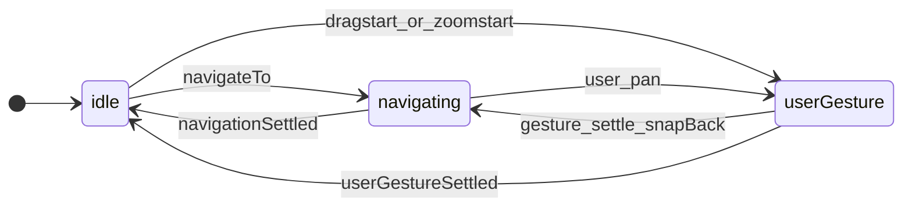
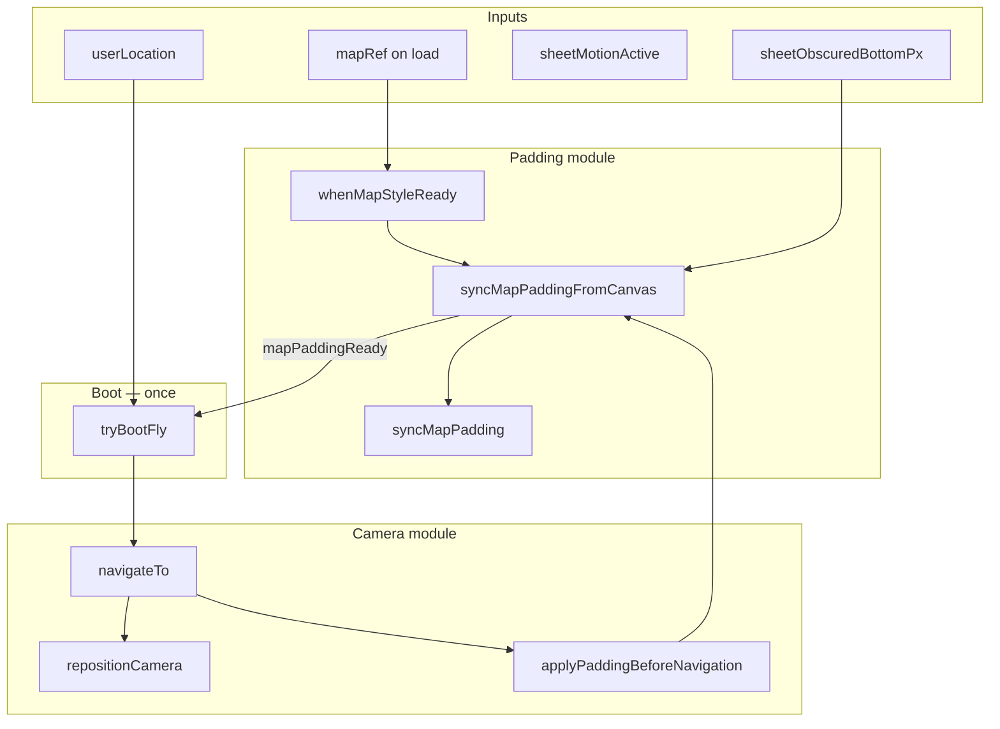

# Sheet-map camera FSM — complete behavior spec

**Purpose:** Single document for rewriting `@siegetag/sheet-map` camera, padding, follow-user, and viewport integration. If implementation disagrees with this doc, the implementation is wrong.

**Related:** [`camera-rules.md`](camera-rules.md) is a shorter index; this file is the full spec.

---

## 1. What question does the FSM answer?

**Who is driving the camera right now?**

| Session | Driver | Ends when |
| ------- | ------ | --------- |
| `idle` | Nobody (at rest) | User starts pan/zoom, or app calls `navigateTo` |
| `userGesture` | User (pan / zoom) | Gesture **fully** settled (`moveend` + `!map.isMoving()`) |
| `navigating` | App (`navigateTo`) | Target reached, sheet idle, `navigationSettled` |

**Not sessions** (orthogonal state):

| State | Owner | Notes |
| ----- | ----- | ----- |
| `followUser`, `hasBootFlown` | Follow reducer | Whether we track GPS and whether boot fly was issued |
| `sheetObscuredBottomPx`, `sheetMotionActive` | `@siegetag/sheet` + DOM | Camera **reacts** only |
| `selectedMapItemId` (future) | App shell | Uses same `navigating` session via `navigateTo` |



### `userGesture` includes momentum

A gesture is **not** over when the finger lifts. It lasts until:

1. Mapbox `moveend`, **and**
2. `map.isMoving() === false` (no inertial coast)

While coasting, session stays `userGesture`. Sheet padding during momentum = **`setPadding` only** from our code — never `jumpTo` / `flyTo` / `map.stop()`. **Accepted:** Mapbox `setPadding` when the sheet moves may still end pan inertia — see [§3.1](#31-accepted-sheet-drag-stops-pan-momentum).

---

## 2. The four rules (original plan — full)

### Rule 1 — Boot and padding (always first)

**Padding**

1. As soon as `mapRef` exists **and style is loaded** **and** `sheetObscuredBottomPx` is provided → call `syncMapPadding` (Mapbox `setPadding`).
2. **No** `snapHeightsMeasured` gate for padding. Sheet height may be `0` on first sync — see [§5 Double setPadding](#5-double-setpadding-expected-vs-bug).
3. Latch `mapPaddingReady` on first successful sync (WeakMap / ref: “this map instance has had `setPadding` at least once”).
4. Every subsequent `sheetObscuredBottomPx` change → sync again if values differ.

**Boot (once per map instance)**

Boot runs **only when all** of:

- Map style loaded (`map.isStyleLoaded()`)
- `mapPaddingReady === true`
- `userLocation` available and `followUser === true`
- Per-map boot latch not set (`!hasBootFlownForMapInstance(map)`)
- Anchor session `idle` (not mid-gesture or mid-nav)

Then:

1. **`navigateTo(user, { duration: smoothFlyMs, zoom: followZoom })`** — programmatic path only.
2. Mark boot on **issue** of `navigateTo` (not after fly settles): `hasBootFlownForMapInstance(map)` + follow reducer `bootFlown`.
3. **`isFollowFocused`** (blue location button) = `followUser && hasBootFlown`.

**Boot order (strict, acyclic):**

```
style ready → syncMapPaddingFromCanvas → mapPaddingReady → tryBootFly → navigateTo
```

**Never:** call boot from inside `syncMapPaddingFromCanvas` or from `applyPaddingBeforeNavigation` (used by `navigateTo`). That creates `padding → boot → navigateTo → padding → …` stack overflow.

**Map instance lifecycle**

On map unmount / `mapRef` swap:

- `releaseMapInstanceCameraState(map)` — clear padding + boot WeakMaps
- `resetBoot` on follow reducer
- Fresh map → fresh boot

**MapCanvas contract**

- Publish `mapRef` to app **on `onLoad` only** (style ready). Do not publish on ref attach before load.
- Unpublish `null` on unmount.

**Style ready**

- `whenMapStyleReady`: if `isStyleLoaded()` → run now; else listen to `load` **and** `idle` until loaded (Strict Mode / cached-style race recovery).

---

### Rule 2 — Programmatic navigation (`navigateTo`)

All programmatic camera moves use **one path:**

`navigateTo` → `navigationStarted` → session `navigating` → `navigationSettled` when at target + sheet idle.

| Trigger | Camera | Session after |
| ------- | ------ | ------------- |
| Boot | smooth fly + zoom | `navigating` → `idle` |
| My-location button | smooth fly | `navigating` → `idle` |
| Gesture settle snap-back (≤40px, still following) | smooth fly | `navigating` → `idle` |
| Future map-item focus | smooth fly | `navigating` → `idle` |

**Not `navigateTo`:**

| Trigger | API | Session |
| ------- | --- | ------- |
| GPS tick while following | `repositionCamera` (instant `jumpTo`) | stays `idle` |

**Inside `navigateTo`:**

1. Update `stateRef` to `navigating` **before** camera commands (re-entrancy safety).
2. `beginProgrammaticNavigation(map, applyPaddingBeforeNavigation)`:
   - `map.stop()` — preempts user momentum (intentional).
   - `applyMapPadding({ realign: false })` — padding only, **no boot**, **no** follow realign.
3. `applyMapAnchorCamera` — fly or jump (`duration: 0` when `sheetMotionActive`).

**While `navigating` + sheet geometry changes:**

After `setPadding`, **jump** to `navigationIntent.target` (duration 0 if sheet moving).

**No side channels:** delete `onSnapBack` callbacks; snap-back is `navigateTo` like boot.

---

### Rule 3 — User gesture

**During gesture (includes momentum)**

| Event | Action |
| ----- | ------ |
| `move` while following | 40px threshold vs `centerOffset`; may `stopFollowingUser` |
| Sheet / padding change | **`setPadding` only** — no `jumpTo` / `flyTo` / `map.stop()` from our code |
| User pan during `navigating` | `userGestureStarted` → `userGesture`, clears nav intent |

**Gesture settle** — single `moveend` dispatcher:

```
moveend
  → consumePaddingSyncMoveEnd? return
  → map.isMoving()? return (wait for momentum)
  → session === userGesture?
       → evaluateFollowAtGestureSettle
       → snapBack (≤40px, following)? navigateTo fly → navigating
       → releaseFollow (>40px)? stopFollowingUser + userGestureSettled → idle
       → else userGestureSettled → idle (commit anchor)
  → session === navigating? trySettleNavigatingSession
```

**No deferred padding flush on momentum `moveend`.** That was the old snap bug.

**No camera move on momentum end** except: snap-back fly at settle (≤40px, following), or anchor commit (not following).

### 3.1 Accepted: sheet drag stops pan momentum

When the user is **panning with inertia** (`userGesture`, `map.isMoving()`) and the **sheet moves** (drag or settle animation), live padding sync calls Mapbox `setPadding`. **Pan coasting will stop.** This is accepted product behavior — we do **not** defer, coalesce, or skip padding updates to preserve momentum.

| Layer | Rule |
| ----- | ---- |
| **Our code** | `setPadding` only — no `jumpTo`, `flyTo`, or `map.stop()` on sheet-driven padding |
| **Mapbox** | `setPadding` may interrupt pan inertia when padding changes mid-coast |
| **Do not** | Defer padding until `moveend`, batch on momentum end, or alternate padding mechanism — those caused worse bugs or wrong geometry |

**Implication for tests:** integration tests assert we do not call `jumpTo`/`flyTo` on sheet padding during `userGesture`; they do **not** require Mapbox to keep coasting alive.

---

### Rule 4 — Sheet ownership

| Concern | Owner |
| ------- | ----- |
| Snap heights, drag phase, settle animation | `@siegetag/sheet` |
| `sheetObscuredBottomPx` (live DOM) | `useLiveSheetObscuredBottomPx` |
| `sheetMotionActive` | sheet phase !== `idle` |
| Mapbox `setPadding` | `useMapAnchor` / `syncMapPadding` |
| Camera session FSM | `useMapAnchor` |

Camera hook **reacts** to sheet inputs. No duplicate sheet FSM in camera code.

---

## 3. Padding + camera matrix (`applyMapPadding`)

After `syncMapPaddingFromCanvas`, optionally realign camera:

| Session | Follow | Sheet moves | Camera after `setPadding` |
| ------- | ------ | ----------- | ------------------------- |
| `idle` | off | yes | **none** (Mapbox keeps center stable) |
| `idle` | on | yes | jump to user |
| `userGesture` | off | yes | **no jumpTo/flyTo** from our code (`setPadding` only; coast may still end — §3.1) |
| `userGesture` | on | yes | **no jumpTo/flyTo** from our code; snap-back at pan settle only |
| `navigating` | * | yes | jump to `navigationIntent.target` |

`applyPaddingBeforeNavigation` (inside `navigateTo`): always `realign: false`.

---

## 4. Viewport, center offset, and debug overlay

These are **separate from** the anchor session FSM but **feed** follow threshold and UI.

### Data flow (demo / app)

```
MapCanvas onLoad → mapRef
useLiveSheetObscuredBottomPx(mapRef) → sheetObscuredBottomPx, sheetPhase
useMapVisibleViewportSync(mapRef, snapHeights, …) → clientRect, centerOffset
useMapFollowUser(mapRef, sheetObscuredBottomPx, centerOffset, …) → camera
MapVisibleAreaDebug(clientRect) → dashed “visible map” overlay
MapVisibleAreaOverlay(clientRect) → positions my-location button
```

### When `MapVisibleAreaDebug` shows

Renders **only if** `clientRect !== null`.

`clientRect` is **null** when any of:

| Condition | Why |
| --------- | --- |
| `mapRef === null` | Map not published yet (before `onLoad`) |
| Canvas `clientWidth` or `clientHeight === 0` | Map not laid out / hidden |
| `hasVisibleArea === false` | Computed visible height or width ≤ 0 (sheet covers entire map) |
| `readSyncViewport` returns null | Zero-size canvas |

**Expected on refresh:** Brief period with **no overlay** until `mapRef` published on load + canvas has size + sheet DOM measurable. This is normal — not a camera FSM bug by itself.

### How visible rect is computed

`resolveMapVisibleViewport(canvas, chrome)`:

1. Read canvas screen geometry.
2. **Live sheet only:** `readLiveSheetObscuredBottomPx(canvas)` — queries `.sheet-slide` under sheet host.
   - If `.sheet-slide` **missing** or canvas size is zero → return **null** (`clientRect` stays null; no snap-height fallback).
3. Build `clientRect`, `centerOffset` (offset from canvas center to visible rect center).
4. `hasVisibleArea = width > 0 && height > 0`.

`useMapVisibleViewportSync` re-runs when: canvas/map ref, resize, DOM observers (canvas + sheet slide), or visual viewport changes.

### Debug env vars (demo)

| Variable | Effect |
| -------- | ------ |
| `VITE_SHEET_MAP_DEBUG=true` | `[map-padding-from-canvas] setPadding` logs |
| (viewport) | Pass `debug: true` to `useMapVisibleViewportSync` for `[map-visible-viewport-sync]` logs |

### Relationship: padding vs visible rect

- **Mapbox padding** (`setPadding`): from `computeMapPadding(sheetObscuredBottomPx)` — drives where Mapbox thinks the “viewport” is for centering/flyTo.
- **Visible rect / overlay**: from live DOM geometry only — drives **40px threshold** (`centerOffset`) and debug chrome.

Both paths use the same live `.sheet-slide` read when DOM is ready. They can **temporarily disagree** when:

- `sheetObscuredBottomPx` hook state is still `0` while DOM already has sheet (first render before `syncFromDom`).

**Rewrite guidance:** No snap fallback for viewport — if sheet is not in the DOM, overlay stays hidden until measurable.

---

## 5. Double setPadding: expected vs bug

### Bug (do not do)

- **`setPadding { bottom: 0 }` on cold load** because React state initialized to `0` while `.sheet-slide` was already measurable — padding must **read live DOM at apply time** and **skip** when `readLiveSheetObscuredBottomPx` returns `null`.
- Boot triggered from inside padding sync → infinite recursion.
- Third+ `setPadding` with **same** values → should be no-op (`areMapPaddingOptionsEqual`).
- Padding `moveend` triggering gesture settle or boot.

### Expected (occasional second call)

After the DOM-read fix, a second `setPadding` on refresh means the **live obscured height actually changed** (e.g. sheet layout caught up, snap height remeasured) — not stale React state. Dedup handles identical consecutive values.

There is **no single “layout settled forever”** signal for padding. Padding is a **continuous stream** from live `.sheet-slide` geometry while the sheet moves; `sheetPhase === idle` gates **boot** (phase 5), not every padding tick.

### Boot gating (phase 5 — separate from padding)

| Policy | Behavior |
| ------ | -------- |
| **A (permissive)** | Boot after first `mapPaddingReady` from live DOM |
| **B (strict)** | Boot only after `sheetObscuredBottomPx > 0` or first sheet `idle` — avoids fly with wrong padding |

---

## 6. Follow-user (`useMapFollowUser`)

| Concern | Rule |
| ------- | ---- |
| Auto-follow | When GPS available → `startFollowUser` |
| `isFollowFocused` | `followUser && hasBootFlown` (blue after boot **issued**) |
| GPS updates | `repositionCamera` when `session === idle` only |
| My-location button | `navigateTo` (same as boot path, not `repositionCamera`) |
| Snap-back | `navigateTo` at gesture settle (≤40px) |

**Geolocation (demo):** Browsers may block `watchPosition` without user gesture. App should still get location via `getCurrentPosition` + error fallback, or boot waits until location exists — **no padding/boot without location for follow mode**.

---

## 7. Single `moveend` dispatcher (invariant)

**Exactly one** map `moveend` handler for session logic. Order:

1. `consumePaddingSyncMoveEnd` → return
2. `map.isMoving()` → return
3. `userGesture` → gesture settle
4. `navigating` → `trySettleNavigatingSession`
5. else noop

No second padding `moveend` listener. No deferred padding queue.

---

## 8. Architecture for rewrite (acyclic)



### Module layout

```
camera/
  apply-map-padding.ts       # syncMapPaddingFromCanvas + realign matrix (pure)
  evaluate-gesture-settle.ts   # pure settle decision
  reposition-camera.ts         # GPS jump, no session
  sync-map-padding.ts          # Mapbox setPadding + padding moveend flag
  when-map-style-ready.ts      # style load subscription
  map-instance-camera-state.ts # per-map boot + padding latches
  use-map-anchor.ts            # session FSM, listeners, navigateTo, padding lifecycle, boot
  use-map-follow-user.ts       # follow reducer, boot config, GPS

viewport/
  use-live-sheet-obscured-bottom-px.ts
  use-map-visible-viewport-sync.ts
  MapVisibleAreaDebug / MapVisibleAreaOverlay
```

### Three camera APIs (no cycles)

| API | Enters `navigating`? | Calls padding? |
| --- | -------------------- | -------------- |
| `syncMapPaddingFromCanvas` | No | Yes |
| `navigateTo` | Yes | Yes via `applyPaddingBeforeNavigation` only |
| `repositionCamera` | No | No |
| `tryBootFly` | Via `navigateTo` once | No direct call |

---

## 9. Combinatorial trace (summary)

Full matrix in original plan; key rows:

| Session | Padding change | Result |
| ------- | -------------- | ------ |
| `idle` + follow | sheet moves | setPadding + jump user |
| `userGesture` + follow | sheet moves | setPadding only |
| `navigating` | sheet moves | setPadding + jump to nav target |
| `userGesture` | momentum ends, ≤40px | navigateTo snap-back |
| `userGesture` | momentum ends, >40px | stop follow, idle |

**Gaps that must be implemented:**

| ID | Fix |
| -- | --- |
| G1 | GPS uses `repositionCamera`, not `navigateTo` |
| G2 | Nav settle checks zoom when intent includes zoom |
| G3 | GPS / boot read `session` from `stateRef`, not stale closure |
| G4 | Snap-back from `moveend`: update `stateRef` before `stopMapMotion` |

---

## 10. What we learned from the broken implementation

| Mistake | Symptom |
| ------- | ------- |
| Boot inside padding sync | Stack overflow |
| `mapRef` before style load | Refresh: no padding, no boot |
| `once('load')` only | Missed load after Strict Mode cleanup |
| Defer/flush padding on `moveend` | Momentum snap bug |
| `onSnapBack` callback | Bypassed FSM |
| `biome-ignore` on effect deps | Hidden lifecycle bugs |
| Two hooks racing on boot | Intermittent boot skip |
| `tryBootFly` + `[tryBootFly]` + padding effect all firing boot | Double fly / race |

**Do not re-introduce:** defer queues, WeakMap defer state, `preserveVisibleCenter`, separate padding hook, fourth anchor session, boot from padding path.

---

## 11. Manual test checklist

- [ ] **Load:** style ready → padding from live DOM → one boot fly → blue button
- [ ] **Refresh ×5:** same as load every time
- [ ] **Debug overlay:** appears after map load + layout; absent before load is OK
- [ ] **My-location:** smooth fly, no crash
- [ ] **Pan + sheet during momentum (following):** padding tracks live; **coast may stop when sheet moves** (accepted); snap-back fly only at pan settle if ≤40px
- [ ] **Pan + sheet (not following):** padding tracks; coast may stop when sheet moves; no extra camera API on pan settle
- [ ] **Pan >40px while following:** follow releases
- [ ] **Boot / my-location + sheet drag:** instant jumps to target while navigating
- [ ] **GPS while following:** instant jump, session stays idle

---

## 12. Out of scope (do not add during rewrite)

- Map item selection reducer (uses same `navigateTo`)
- Renaming `navigating` → `programmatic`
- `NavigationIntent.reason` (optional metadata only)
- Backwards-compat shims for old APIs

---

## 13. Success criteria

Implementation matches **§2 four rules**, **§7 single moveend**, **§8 acyclic architecture**, and passes **§11 checklist** on sheet-map-demo with `VITE_SHEET_MAP_DEBUG=true`.
