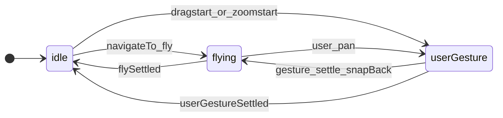
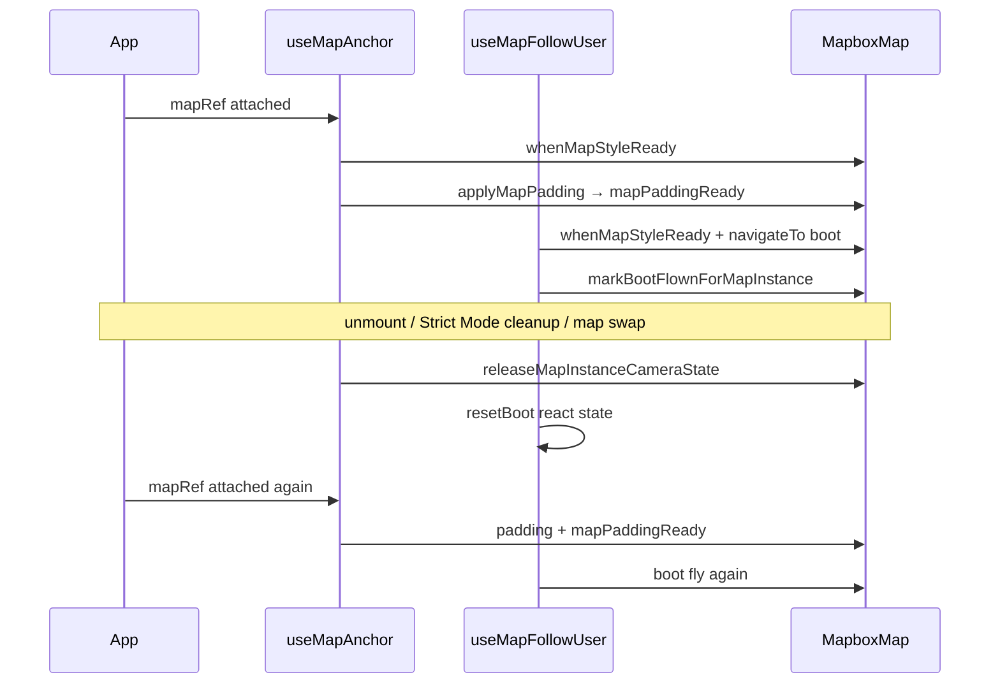

# Sheet-map camera rules

**Short index.** Full rewrite spec (all four rules, viewport/debug overlay, double padding, architecture): **[`camera-fsm-plan.md`](camera-fsm-plan.md)**.

Authoritative behavior for `@siegetag/sheet-map` map camera, padding, and follow-user. Implementation will live under [`packages/sheet-map/src/camera/`](../src/camera/) as phases land.

## What question does the FSM answer?

**Who is driving the camera right now?**

| Session | Driver | Typical duration |
| ------- | ------ | ---------------- |
| `idle` | Nobody (at rest) | Between user pans and programmatic moves |
| `userGesture` | User (pan / zoom) | From `dragstart` / `zoomstart` until gesture **fully** settles |
| `flying` | App (animated fly) | From `navigateTo` with `duration > 0` until target reached and sheet idle |

Orthogonal state (not sessions):

- **Follow:** `followUser`, `hasBootFlown` — [`reduce-map-follow.ts`](../src/camera/follow/reduce-map-follow.ts)
- **Selection (future):** `selectedMapItemId` — app shell, not anchor session
- **Sheet geometry:** `sheetObscuredBottomPx`, `sheetMotionActive` — owned by `@siegetag/sheet`

## `userGesture` includes momentum

A user gesture is **not** over when the finger lifts. It lasts until:

1. Mapbox fires `moveend`, **and**
2. `map.isMoving()` is false (no inertial coast)

While the map is coasting after a pan, session stays **`userGesture`**. Threshold checks, padding rules, and settle logic all apply to this whole period — not only finger-down dragging.

**Implication:** sheet padding during pan + momentum must **not** call `jumpTo` / `flyTo` / `map.stop()` from our code — only `setPadding`. **Accepted:** Mapbox `setPadding` when the sheet moves may end pan inertia anyway ([`camera-fsm-plan.md` §3.1](camera-fsm-plan.md#31-accepted-sheet-drag-stops-pan-momentum)).

Recenter while following during a gesture happens at **gesture settle** (mandatory snap-back fly if within 40px), not on every sheet padding tick.

---

## Rule 1 — Boot and padding (always first)

1. As soon as `mapRef` + `sheetObscuredBottomPx` exist → `syncMapPadding` (no snap-height gate for padding).
2. Latch `mapPaddingReady` on first successful `setPadding`.
3. Boot fly **once** when: `mapPaddingReady && styleLoaded && userLocation && !hasBootFlown`.
4. Boot uses `navigateTo` with smooth fly + explicit zoom.
5. Set `hasBootFlown` when boot `navigateTo` is **issued** (not only after settle).

**Critical:** `syncMapPaddingFromCanvas` and boot are **separate steps**. Boot runs only from `tryBootFly` (never from inside padding sync or `applyPaddingBeforeNavigation`) — otherwise `navigateTo → padding → boot → navigateTo` overflows the stack.

---

## Rule 2 — Camera moves: `navigateTo` only

One public API. **`anchor`** (lat/lng/zoom) is whatever should stay centered.

| Call | `map.stop()` | Session | Use |
| --- | ------------ | ------- | --- |
| **`navigateTo`**, `duration > 0` | yes | → `flying` → settle → `idle` | Boot, my-location, snap-back, demo fly |
| **`navigateTo`**, `duration === 0` | yes | stays `idle` | GPS ticks while tracking |

Padding realign uses `moveCameraProgrammatic({ stopUserMotion: false })` internally — not a public API.

### `navigateTo` options

| Option | Default | Meaning |
| ------ | ------- | ------- |
| `duration` | `0` (jump) | Fly ms when sheet idle; forced jump while sheet moves |
| `keepFollowing` | `false` | Keep GPS follow. Boot, snap-back, recenter pass `true`. Demo fly releases follow. |

`navigateTo` → optional `stopFollowingUser` → set **`anchor`** → `map.stop()` → padding sync (`realign: false`) → fly/jump. Animated flies dispatch `flyStarted`; instant jumps do not.

While **`flying`** or **`idle`** + sheet geometry changes: after `setPadding`, **jump** to **`anchor`** (unless `userGesture`).

---

## Rule 3 — User gesture

### During gesture (includes momentum)

| Event | Action |
| ----- | ------ |
| `move` while following | 40px threshold vs `centerOffset`; may `stopFollowingUser` |
| Sheet / padding change | **`setPadding` only** — no `jumpTo`, `flyTo`, or `map.stop()` from our code |
| User starts new pan during `flying` | `userGestureStarted` → session `userGesture` |

### Gesture settle (`moveend` when `!map.isMoving()`)

Single dispatcher ([`listeners.ts`](../src/camera/hooks/use-map-anchor/listeners.ts) via `resolveMoveEnd`):

1. `consumePaddingSyncMoveEnd` → padding-only branch in `resolveMoveEnd`
2. If still `map.isMoving()` → noop (momentum not done)
3. If following and over threshold → `stopFollowingUser` + `userGestureSettled` → `idle` (**5D**)
4. If following and ≤ threshold → **`navigateTo` snap-back fly** → `flying` (**5D**)
5. Else → `userGestureSettled` → `idle` (commit anchor)

Threshold: **`followReleaseThresholdPx`** on `useMapFollowUser` / `useMapAnchor` (app default often 40 — not hardcoded in `anchor/`).

**No snap from deferred padding on momentum end.** The only camera move when the finger lifts (while following, ≤40px) is the mandatory programmatic snap-back fly.

---

## Rule 4 — Sheet ownership

The sheet package owns snap heights, drag phase, and `sheetObscuredBottomPx`. The camera hook **reacts** only — no duplicate sheet FSM.

---

## Padding + camera (`applyMapPadding`)

| Session | Sheet moves | Camera after `setPadding` |
| ------- | ----------- | ------------------------- |
| `userGesture` | yes | `setPadding` only (no jump) |
| `idle` or `flying` | yes | jump to **`anchor`** |

Entry point: [`padding/apply.ts`](../src/camera/padding/apply.ts).

---

## Follow-user (`useMapFollowUser`)

Apps import **`useMapFollowUser` only** — it composes internal `useMapAnchor`.

- Auto-starts follow when GPS available.
- **`tracking`:** alias for `followUser` (gray button when false, blue when true).
- **Dot halo `focused`:** `tracking && hasBootFlown` (brighter halo after boot).
- GPS updates: `navigateTo({ duration: 0, keepFollowing: true })` when `session === "idle"`.
- My-location button: `recenterOnUser` → `navigateTo` fly with `keepFollowing: true`.
- Fly to another place (demo point, map item): `navigateTo` without `keepFollowing` → follow released, button turns gray.
- Snap-back at gesture settle: `navigateTo` with `keepFollowing: true`.
- **Debug:** with `VITE_SHEET_MAP_DEBUG=true`, GPS logs `[map-follow-gps] navigate`; skipped ticks while non-idle log `[map-follow-gps] skipped`.

**Demo padding logs:** set `VITE_SHEET_MAP_DEBUG=true` in `apps/sheet-map-demo/.env` to see `[map-padding-from-canvas] setPadding` in the console.

---

## Map instance lifecycle (why refresh must keep working)

Module-level **WeakMap latches** track padding sync and boot completion **per Mapbox map instance**. They must be **released when the map is torn down** — otherwise dev Strict Mode, HMR, and map swaps leave stale “already booted” state on a fresh surface.

| Step | Module | Rule |
| ---- | ------ | ---- |
| Style ready | `shared/when-map-style-ready.ts` | `load` + `idle` until `isStyleLoaded()`; MapCanvas publishes `mapRef` on **load only** |
| Padding | `padding/apply.ts` | After style ready; latch `mapPaddingReady` |
| Boot | `boot-coordinator.ts` + `boot/try-boot-fly.ts` | After `mapPaddingReady` via `onPaddingReady` → `attemptBoot`; uses `navigateTo` (no session gate) |
| Release | `instance/camera-state.ts` + `onMapInstanceReleased` | On map unmount: clear padding + boot WeakMaps; reset follow `hasBootFlown` |

**Do not** gate boot on React `hasBootFlown` alone — Strict Mode preserves that state across effect re-runs while the visible map instance is reset.

---

## Future: map items

Click map dot or sheet row → `navigateTo(item)` (session `flying` when animated). Selection state is separate. Close sheet → deselect only; no required camera move. **No fourth anchor session.**

Optional: `NavigationIntent.reason` (`boot` | `myLocation` | `snapBack` | `mapItem`) for tests/logging.

---

## Module map

| Module | Role |
| ------ | ---- |
| `anchor/reduce.ts` | Session reducer |
| `follow/reduce-map-follow.ts` | Follow latch |
| `padding/apply.ts` | Padding sync + realign matrix |
| `anchor/resolve-move-end.ts` | Pure moveend branching (5D: gesture settle) |
| `shared/reposition-camera.ts` | GPS instant jump without session |
| `padding/sync.ts` | Mapbox `setPadding` + padding moveend flag |
| `hooks/use-map-anchor/` | Listeners, `navigateTo`, padding, **boot coordinator**, single `moveend` dispatcher |
| `hooks/use-map-follow-user.ts` | Boot target, GPS, threshold option, composes anchor |

---

## Manual test checklist (sheet-map-demo)

- [ ] Load: padding before fly, location button focused
- [ ] My-location: smooth fly, no crash
- [ ] Pan + sheet **during momentum** (following): padding tracks; **coast may stop when sheet moves** (accepted); snap-back fly at pan settle if ≤40px
- [ ] Pan + sheet **during momentum** (not following): padding tracks; coast may stop when sheet moves; no extra camera API on pan settle
- [ ] Pan >40px while following: follow releases
- [ ] Boot / my-location + sheet drag: instant jumps to target
- [ ] GPS while following: instant jump, not fly
