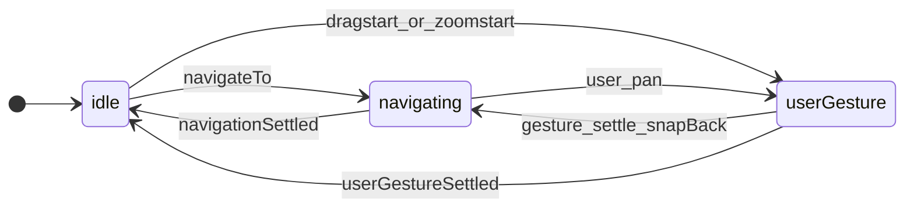
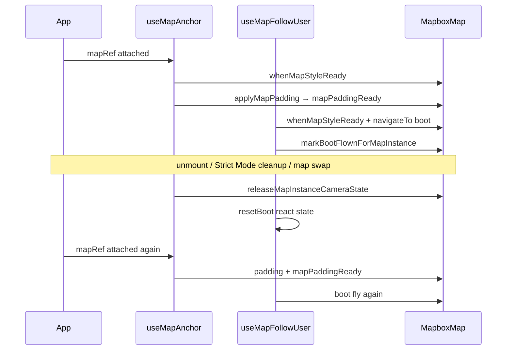

# Sheet-map camera rules

**Short index.** Full rewrite spec (all four rules, viewport/debug overlay, double padding, architecture): **[`camera-fsm-plan.md`](camera-fsm-plan.md)**.

Authoritative behavior for `@siegetag/sheet-map` map camera, padding, and follow-user. Implementation will live under [`packages/sheet-map/src/camera/`](../src/camera/) as phases land.

## What question does the FSM answer?

**Who is driving the camera right now?**

| Session | Driver | Typical duration |
| ------- | ------ | ---------------- |
| `idle` | Nobody (at rest) | Between user pans and programmatic moves |
| `userGesture` | User (pan / zoom) | From `dragstart` / `zoomstart` until gesture **fully** settles |
| `navigating` | App (programmatic) | From `navigateTo` until target reached and sheet idle |

Orthogonal state (not sessions):

- **Follow:** `followUser`, `hasBootFlown` — [`reduce-map-follow.ts`](../src/camera/follow/reduce-map-follow.ts)
- **Selection (future):** `selectedMapItemId` — app shell, not anchor session
- **Sheet geometry:** `sheetObscuredBottomPx`, `sheetMotionActive` — owned by `@siegetag/sheet`

## `userGesture` includes momentum

A user gesture is **not** over when the finger lifts. It lasts until:

1. Mapbox fires `moveend`, **and**
2. `map.isMoving()` is false (no inertial coast)

While the map is coasting after a pan, session stays **`userGesture`**. Threshold checks, padding rules, and settle logic all apply to this whole period — not only finger-down dragging.

**Implication:** sheet padding during pan + momentum must **not** call `jumpTo` / `flyTo` / `map.stop()` from our code — only `setPadding`. **Accepted:** Mapbox `setPadding` when the sheet moves may end pan inertia anyway ([`camera-fsm-plan.md` §3.1](camera-fsm-plan.md#31-accepted-sheet-drag-stops-pan-momentum)).

Recenter while following during a gesture happens at **gesture settle** (mandatory snap-back fly if within 40px), not on every sheet padding tick.

---

## Rule 1 — Boot and padding (always first)

1. As soon as `mapRef` + `sheetObscuredBottomPx` exist → `syncMapPadding` (no snap-height gate for padding).
2. Latch `mapPaddingReady` on first successful `setPadding`.
3. Boot fly **once** when: `mapPaddingReady && styleLoaded && userLocation && !hasBootFlown`.
4. Boot uses `navigateTo` with smooth fly + explicit zoom.
5. Set `hasBootFlown` when boot `navigateTo` is **issued** (not only after settle).

**Critical:** `syncMapPaddingFromCanvas` and boot are **separate steps**. Boot runs only from `tryBootFly` (never from inside padding sync or `applyPaddingBeforeNavigation`) — otherwise `navigateTo → padding → boot → navigateTo` overflows the stack.

---

## Rule 2 — Programmatic navigation (`navigateTo`)

All programmatic moves: **`navigateTo`** → `navigationStarted` → session `navigating` → `navigationSettled`.

| Trigger | Camera | Session after |
| ------- | ------ | ------------- |
| Boot | smooth fly + zoom | `navigating` → `idle` when settled |
| My-location button | smooth fly | `navigating` → `idle` |
| Gesture settle snap-back (≤40px, still following) | smooth fly | `navigating` → `idle` |
| Future map-item focus | smooth fly | `navigating` → `idle` |

**Not** `navigateTo`:

| Trigger | API | Session |
| ------- | --- | ------- |
| GPS tick while following | `repositionCamera` (instant jump) | stays `idle` |

`beginProgrammaticNavigation` calls `map.stop()` before fly/jump — intentional; programmatic moves preempt user momentum.

While **`navigating`** + sheet geometry changes: after `setPadding`, **jump** to `navigationIntent.target` (duration 0 if sheet is moving).

---

## Rule 3 — User gesture

### During gesture (includes momentum)

| Event | Action |
| ----- | ------ |
| `move` while following | 40px threshold vs `centerOffset`; may `stopFollowingUser` |
| Sheet / padding change | **`setPadding` only** — no `jumpTo`, `flyTo`, or `map.stop()` from our code |
| User starts new pan during `navigating` | `userGestureStarted` → session `userGesture`, clears nav intent |

### Gesture settle (`moveend` when `!map.isMoving()`)

Single dispatcher ([`use-map-anchor.ts`](../src/camera/use-map-anchor.ts) `handleMoveEnd`):

1. `consumePaddingSyncMoveEnd` → return (padding-only moveend)
2. If still `map.isMoving()` → return (wait; momentum not done)
3. If following and over 40px → `stopFollowingUser` + `userGestureSettled` → `idle`
4. If following and ≤40px → **`navigateTo` snap-back fly** → `navigating` (do not `userGestureSettled` first)
5. Else → `userGestureSettled` → `idle` (commit anchor)

**No snap from deferred padding on momentum end.** The only camera move when the finger lifts (while following, ≤40px) is the mandatory programmatic snap-back fly.

---

## Rule 4 — Sheet ownership

The sheet package owns snap heights, drag phase, and `sheetObscuredBottomPx`. The camera hook **reacts** only — no duplicate sheet FSM.

---

## Padding + camera matrix (`applyMapPadding`)

| Session | Follow | Sheet moves | Camera after `setPadding` |
| ------- | ------ | ----------- | ------------------------- |
| `idle` | off | yes | none (Mapbox keeps center stable) |
| `idle` | on | yes | jump to user (`repositionCamera`-style jump) |
| `userGesture` | off | yes | no jumpTo/flyTo from our code (`setPadding` only; coast may end — plan §3.1) |
| `userGesture` | on | yes | no jumpTo/flyTo from our code; snap-back at pan settle |
| `navigating` | * | yes | jump to `navigationIntent.target` |

Entry point: [`apply-map-padding.ts`](../src/camera/apply-map-padding.ts).

---

## Follow-user (`useMapFollowUser`)

- Auto-starts follow when GPS available.
- **`isFollowFocused`:** `followUser && hasBootFlown` (blue only after boot `navigateTo` succeeds).
- GPS updates: `repositionCamera` only when `session === "idle"`.
- Snap-back at gesture settle: `navigateTo` (same path as my-location).

**Demo padding logs:** set `VITE_SHEET_MAP_DEBUG=true` in `apps/sheet-map-demo/.env` to see `[map-padding-from-canvas] setPadding` in the console.

---

## Map instance lifecycle (why refresh must keep working)

Module-level **WeakMap latches** track padding sync and boot completion **per Mapbox map instance**. They must be **released when the map is torn down** — otherwise dev Strict Mode, HMR, and map swaps leave stale “already booted” state on a fresh surface.

| Step | Module | Rule |
| ---- | ------ | ---- |
| Style ready | `when-map-style-ready.ts` | `load` + `idle` until `isStyleLoaded()`; MapCanvas publishes `mapRef` on **load only** |
| Padding | `apply-map-padding.ts` | After style ready; latch `mapPaddingReady` |
| Boot | `use-map-anchor.ts` `tryBootFly` | After `mapPaddingReady`; **never** from padding sync path |
| Release | `map-instance-camera-state.ts` + `onMapInstanceReleased` | On map unmount: clear padding + boot WeakMaps; reset follow `hasBootFlown` |

**Do not** gate boot on React `hasBootFlown` alone — Strict Mode preserves that state across effect re-runs while the visible map instance is reset.

---

## Future: map items

Click map dot or sheet row → `navigateTo(item)` (session `navigating`). Selection state is separate. Close sheet → deselect only; no required camera move. **No fourth anchor session.**

Optional: `NavigationIntent.reason` (`boot` | `myLocation` | `snapBack` | `mapItem`) for tests/logging.

---

## Module map

| Module | Role |
| ------ | ---- |
| `reduce-map-anchor.ts` | Session reducer |
| `reduce-map-follow.ts` | Follow latch |
| `apply-map-padding.ts` | Padding sync + realign matrix |
| `evaluate-gesture-settle.ts` | Pure gesture settle decision |
| `reposition-camera.ts` | GPS instant jump without session |
| `sync-map-padding.ts` | Mapbox `setPadding` + padding moveend flag |
| `use-map-anchor.ts` | Listeners, `navigateTo`, padding, **boot pipeline**, single `moveend` dispatcher |
| `use-map-follow-user.ts` | Boot, GPS, threshold data, composes anchor |

---

## Manual test checklist (sheet-map-demo)

- [ ] Load: padding before fly, location button focused
- [ ] My-location: smooth fly, no crash
- [ ] Pan + sheet **during momentum** (following): padding tracks; **coast may stop when sheet moves** (accepted); snap-back fly at pan settle if ≤40px
- [ ] Pan + sheet **during momentum** (not following): padding tracks; coast may stop when sheet moves; no extra camera API on pan settle
- [ ] Pan >40px while following: follow releases
- [ ] Boot / my-location + sheet drag: instant jumps to target
- [ ] GPS while following: instant jump, not fly
